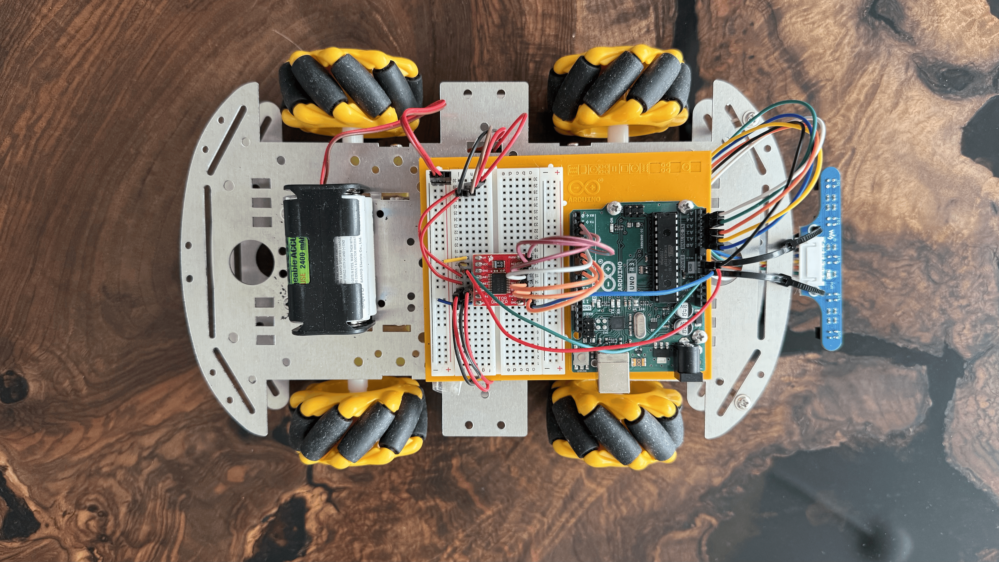
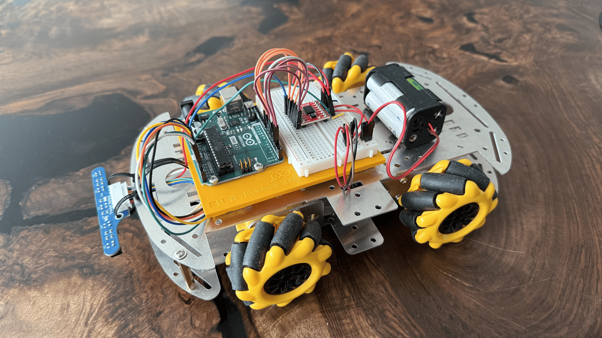

# Mecanum Line Follower Robot

This project is a small autonomous line-following robot built with an **Arduino Uno**, a **5-channel infrared sensor array**, four DC geared motors, and Mecanum wheels. The current version follows a black line using sensor-based steering control, while a future upgrade will turn it into a fully wireless Mecanum platform with independent wheel control.

 <p align="center">
  
  
</p>

---

## 📂 Project Overview

This project is developed in two stages:

1. **V1 — Line Follower:**
   The current prototype uses an Arduino Uno, one TB6612FNG motor driver, and a 5-channel IR sensor array. The four motors are controlled as a left and a right motor group, allowing differential-style steering for autonomous line following.

2. **V2 — Full Mecanum Platform *****(Upcoming)*****:**
   The planned upgrade will use an ESP32 and two TB6612FNG motor drivers to control all four wheels independently. It will include wireless manual driving, multiple operating modes, and a small OLED-based interface.

---

## 🎥 V1 Demonstration

<p align="center">
  <a href="media/line_following_v1.mp4">
    
  </a>
</p>

---

## ⚙️ Version Overview

| Feature        | V1 — Current                     | V2 — Upcoming                                        |
| -------------- | -------------------------------- | ---------------------------------------------------- |
| Controller     | Arduino Uno                      | ESP32                                                |
| Motor Drivers  | 1× TB6612FNG                     | 2× TB6612FNG                                         |
| Motor Control  | Left/right motor pairs           | Four independent motors                              |
| Movement       | Line-following steering          | Full Mecanum movement                                |
| Power          | Powerbank + 4× AA NiMH batteries | To be determined                                     |
| Manual Control | —                                | Wireless ESP32 controller                            |
| Interface      | —                                | Small OLED display                                   |
| Modes          | Line Following                   | Line Following, Calibration Profiles, Manual Driving |

---

# V1 — Autonomous Line Follower

## 🔩 Hardware

| Component                 | Purpose                      |
| ------------------------- | ---------------------------- |
| Arduino Uno               | Main controller              |
| TB6612FNG                 | Dual-channel DC motor driver |
| 5-Channel IR Sensor Array | Line position detection      |
| 4× Yellow TT DC Motors    | Locomotion                   |
| 4× Mecanum Wheels         | Wheel platform               |
| 4× AA NiMH Batteries      | Motor supply                 |
| USB Powerbank             | Arduino supply               |

---

## 🔋 System Setup

The Arduino and the motors are powered separately:

```text
Powerbank ──▶ Arduino Uno ──▶ Sensor Array + TB6612 Logic Supply

4× AA NiMH ──▶ TB6612 Motor Supply ──▶ DC Motors
```

The motor battery pack supplies approximately:

$$
V_\text{motor} = 4 \cdot 1.2\text{ V} = 4.8\text{ V}
$$

All components share a common ground so that the Arduino control signals and sensor readings use the same voltage reference.

---

## 🛞 Mecanum Assembly

The four Mecanum wheels are mounted in the standard X-configuration when viewed from above:

```text
Front

\        /
 \      /

 /      \
/        \

Rear
```

In V1, the left motor pair and right motor pair are each driven together by one motor-driver channel. Therefore, the vehicle currently behaves like a differential-drive robot. Full sideways and diagonal Mecanum movement will be introduced in V2 through independent four-wheel control.

---

## 👁️ Line Detection

The robot follows a **black line on a bright floor**. During testing, the uncovered floor produced sensor values of approximately:

$$
r_{floor} \approx 900
$$

Since the black line reflects less infrared light, it produces a lower reading. The strength of the detected line for each sensor is calculated as:

$$
s_i = \max(0, r_{floor_i} - r_i)
$$

where:

* $r_i$ is the raw reading of sensor $i$,
* $r_{floor_i}$ is the calibrated bright-floor reading,
* $s_i$ is the detected black-line intensity.

A practical difficulty is mounting the IR sensor array at the correct height. The readings depend strongly on surface contrast, ambient light, and distance from the floor. For the current prototype, a height of roughly **5–8 mm** above the surface provides a strong contrast between the floor and the black line.

---

## 🧠 PID Steering Controller

<p align="center">
  
</p>

<p align="center">
  <em>Classical PID control loop.</em>
</p>

### Estimating the Line Position

The five sensors are assigned positional weights from left to right:

```text
Sensor:    S1     S2     S3     S4     S5
Weight:    -3     -1      0     +1     +3
```

The outer sensors use larger weights so that the robot reacts more strongly when it is close to losing the line.

The estimated line position is calculated using a weighted average:

$$
p = \frac{\sum_{i=1}^{5} w_i s_i}{\sum_{i=1}^{5} s_i}
$$

The target position is the center of the sensor array:

$$
p_\text{target} = 0
$$

Therefore, the tracking error is:

$$
e(t) = p(t)
$$

A negative error indicates that the line is located toward the left side of the robot; a positive error indicates that it is located toward the right side.

---

### PID Control Law

The steering correction is calculated using the PID controller:

$$
u(t) =
K_P e(t)
+
K_I \int_0^t e(\tau) d\tau
+
K_D \frac{de(t)}{dt}
$$

The three terms have different effects:

| Term | Purpose                      | Behaviour                                                  |
| ---- | ---------------------------- | ---------------------------------------------------------- |
| $P$  | Reacts to the current error  | Stronger turn when the line is farther from the center     |
| $I$  | Accumulates persistent error | Compensates constant bias, such as unequal motor behaviour |
| $D$  | Reacts to changes in error   | Dampens overshoot and oscillation                          |

Since the controller runs repeatedly on the Arduino, the implemented form is discrete:

$$
u_k =
K_P e_k
+
K_I \sum_{j=0}^{k} e_j
+
K_D(e_k-e_{k-1})
$$

The correction is applied to the two motor groups:

$$
v_L = v_\text{base} + u_k
$$

$$
v_R = v_\text{base} - u_k
$$

Allowing negative motor commands enables one side to rotate backwards during sharp turns, significantly reducing the turning radius.

---

## 🎛️ PID Tuning

### Practical Tuning Approach

The controller is tuned incrementally:

1. Set the integral and derivative terms to zero:

$$
K_I = 0 \qquad K_D = 0
$$

2. Increase $K_P$ until the robot follows the line reliably but begins to oscillate around it.

3. Add a small $K_D$ term to reduce overshooting and smooth the movement.

4. Add $K_I$ only if the robot shows a consistent long-term drift to one side.

For this robot, a **P or PD controller** is generally sufficient. A large derivative term can amplify noisy sensor readings and cause jittering, while an unnecessary integral term can accumulate error during tight turns and lead to overshooting.

---

### Ziegler–Nichols Method

A classical systematic tuning approach is the **Ziegler–Nichols closed-loop method**:

1. Set:

$$
K_I = 0, \qquad K_D = 0
$$

2. Increase $K_P$ until the robot begins to oscillate continuously.

3. Measure:

   * $K_U$: proportional gain at sustained oscillation,
   * $T_U$: oscillation period.

4. Estimate the PID gains:

| Gain  | Ziegler–Nichols Estimate |
| ----- | ------------------------ |
| $K_P$ | $0.6K_U$                 |
| $K_I$ | $\dfrac{1.2K_U}{T_U}$    |
| $K_D$ | $0.075K_UT_U$            |

Although this method provides useful initial parameters, manual fine-tuning is more practical for this robot because the optimal behaviour also depends on motor speed, sensor height, surface contrast, and wheel slip.

---

# V2 — Full Mecanum Platform *(Upcoming)*

V2 will upgrade the robot into a fully controllable Mecanum platform using:

* ESP32 as the main vehicle controller
* Two TB6612FNG motor drivers
* Independent control of all four wheels
* Full sideways, diagonal, and rotational Mecanum movement
* Wireless ESP32-based handheld controller with two joysticks
* Bluetooth or ESP-NOW communication
* Small OLED display on the controller or vehicle
* Multiple modes:

  * Autonomous Line Following
  * Manual Driving
  * Sensor Calibration / Surface Profiles

---

## 📄 License

This project is licensed under the MIT License.

